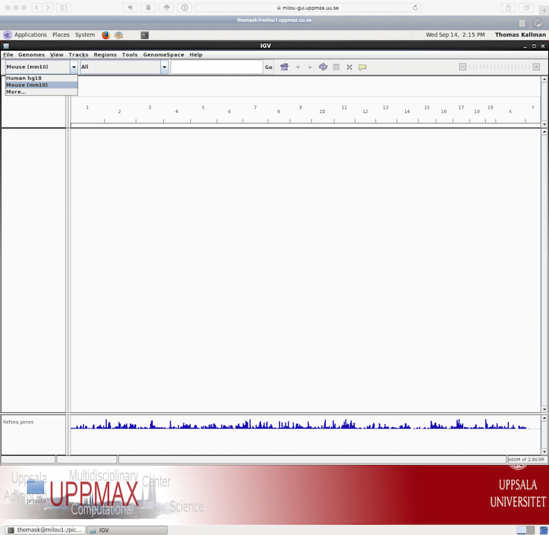

#   Bonus exercise: RNA-seq visualisation

## Introduction

Data visualisation is important to be able to clearly convey results,
but can also be very helpful as tool for identifying issues and
noteworthy patterns in the data. In this part you will use the bam
files you created earlier in the RNA-seq lab and use IGV (Integrated
Genomic Viewer) to visualize the mapped reads and genome
annotations. In addition we will produce high quality plots of both
the mapped read data and the results from differential gene
expression.

## IGV

If you are already familiar with IGV you can load the mouse genome and
at least one bam file from each of the treatments that you created
earlier. The functionality of IGV is the same as if you look at
genomic data, but there are a few of the features that are more
interesting to use for RNA-seq data.

[Integrated genomics viewer](http://software.broadinstitute.org/software/igv/) from Broad Institute is a nice graphical
interface to view bam files and genome annotations. It also has tools
to export data and some functionality to look at splicing patterns in
RNA-seq data sets. Even though it allows for some basic types of
analysis it should be used more as a nice way to look at your mapped
data. Looking at data in this way might seem like a daunting approach
as you can not check more than a few regions, but in in many cases it
can reveal mapping patterns that are hard to catch with just summary
statistics.

For this tutorial you can chose to run IGV directly on your own computer (follow :floppy_disk:)
or on Uppmax (follow :computer:). If you chose to run it on your own computer you will
have to download some of the bam files (and the corresponding index
files) from Upppmax. If you have not yet installed IGV you also
have to get a copy of the program. 

:floppy_disk: **Copy bam files** to your local computer and **run IGV**

:key: Click to see how to transfer files from Uppmax


scp username@milou.uppmax.uu.se:<the path to your results directory goes here>/transcriptome/bamfile.bam .

NB! Use the sorted bam files and also copy over the .bai files

 

:computer:  **Log in to Uppmax** in a way so that the generated graphics are exported via the network to your screen
 
:computer:  Method 1. Login in to Uppmax with X-forwarding enabled

:key: Click to see how


ssh -Y username@milou.uppmax.uu.se
ssh -Y computenode


This will allow any graphical interface that you start
on your compute node to be exported to your computer. However, as
the graphics is exported over the network it can be fairly slow in
redrawing windows and the experience can be fairly poor.

:computer: Method 2. Go to [Milou-gui](https://milou-gui.uppmax.uu.se/main/)

Once you log into this interface you will have a linux desktop
interface in a browser window. This interface is running on the login
node so if you want to do any heavy lifting you need to login to your
reserved compute node also here. This is done by opening a terminal in
the running linux environment and log on to your compute node as before
NB! If you have no active reservation you have to do that first.

 
:computer: **Load necessary modules** and start IGV

module load bioinfo-tools
module load IGV/2.3.40
igv-core


 
:computer: :floppy_disk: Once we have the program running you select the genome that you would
like to load. As seen in the image below. 

Note that if you are working with a genome that are not part of the
available genomes in IGV, one can create genome files from within
IGV. Please check the manual of IGV for more information on that.

To open your bam files click on File and chose the option "Load from
file" select your bam file and make sure that you have a .bai index
for that bam file in the same folder. You can repeat this and open
multiple bam files in the same window, which makes it easy to compare
samples. For every file you open a number of panels are opened that
visualize the data in different ways. The first panel named "Coverage"
summarize the coverage of basepairs in the window you have zoomed
to. The second that ends with the name "Junctions" show how reads were
spliced to map, eg. reads that stretch over multiple exons are split
and mapped one part in one exon and the next in another exon. The
third panel shows the reads as they are mapped to the genome. If one
right click with the mouse on the read panel there many options to
group and color reads. 

To see actual reads you have to zoom in until the reads are
drawn on screen. If you have a gene of interest you can also use
the search box to directly go to that gene. 

If you for example search for the gene "Mocs2" you should see a decent
amount of reads mapping to this region. For more detailed information
on the splice reads you can instead of just looking at the splice
panel right click on the read panel and select "Sashimi plots" This
will open a new window showing in an easy readable fashion how reads
are spliced in mapping and you will also be able to see that there are
differences in between what locations reads are spliced. This hence
gives some indication on the isoform usage of the gene.

To try some of the features available in IGV you can try to address the following
questions. 

:open_mouth: Are the reads you mapped from a stranded or unstranded library?

:open_mouth: Pick a gene from the toplist of most significant genes from the DE
analysis and search for it using the search box in IGV. Would you say that
the pattern you see here confirms the gene as differentially expressed
between treatments?

:open_mouth: One can visualize all genes in a given pathway using the gene list
option under "Regions" in the menu. Would you agree with what they
state in the paper about certain pathways being down-regulated. If you need
hints for how to proceed see [Gene List tutorial at Broad](http://software.broadinstitute.org/software/igv/gene_list_view).
 
 

# Create publication ready plots from RNA-seq data

Creating high quality plots of RNA-seq analysis are most easily done
using [R](https://www.r-project.org). Depending on your profiency in
reading r-code and using R you can in this section either just call
scripts from the command lines with a set of arguments or you can open
the r-script in a text editor and run the code step by step from an
interactive r-session. Irrespective of the method you choose make sure
you load the same R modules as before and do all steps on a compute
node.

:computer: **Load R module and R packages**

:key: Click to see how 


module load R/3.3.0
module load R_packages/3.3.0


 

Some of the example plots we generate here are based on the results from the DE analysis so
perform all of these steps from within the DE folder that you created earlier. 

Start by copying the scripts from the course folder to your DE directory.

:computer: **Move** to DE and **copy** R-scripts

:key: Click to see how to copy the files to your DE folder


cd $resDir/transcriptome/DE
cp /sw/courses/ngsintro/rnaseq/bonus/visual/*.R .


You should now have four files in your DE folder.      We
start off by creating similar plots to how data is visualised in IGV,
but using R means that we could add other types of information that
are not implemented in IGV.

:mag: To look at read coverage in our bam files for a gene of interest
(pick one that was reported to be differentially expressed) and go to
the Ensembl to identify genomic coordinates and chromosome location
for this gene.

:computer: Make a script named genePlot.R

:key: Click for the code to copy into the new file


.libPaths(c("/sw/courses/ngsintro/rnaseq_2016/R-packages/3.3.0", "/pica/sw/apps/R_packages/3.3.0/milou", "/pica/sw/apps/R/x86_64/3.3.0/milou/lib64/R/library"))

# For running as command line script and parsing options from command line
args = commandArgs(trailingOnly=TRUE)
# test if correct number of arguments are given as input: if not, return an error
if (length(args)<3) {
    stop("Please supply chromosome number as well as start and stop position for the plot\n Example: Rscript genePlot.R 2 234243 238555",
         call.=FALSE)
}

library(Gviz)
library(EnsDb.Mmusculus.v79)
edb <- EnsDb.Mmusculus.v79
gen <- "mm10"
chr <- args[1] # parse the first argument after the r-script to chr
start <- args[2] # parse the second argument after the r-script to start
stop <- args[3] # parse the second argument after the r-script to stop
# Collect the sorted bamfile names from bams folder
bamFiles <- list.files("~/glob/transcriptome/bams/", pattern = "*sorted.bam$",
                       full.names = TRUE, recursive = TRUE)
# Allow for using different chromosome names than ucsc
options(ucscChromosomeNames=FALSE)

# create track see Gviz manual for details
gat <- GenomeAxisTrack()
gr <- getGeneRegionTrackForGviz(edb, chromosome = args[1], start = start, end = stop)
genome(gr) <- "mm10"

alTracklist <- lapply(seq_along(bamFiles), function(x) AlignmentsTrack(
                                                           bamFiles[[x]],
                                                           chromosome = chr,
                                                           genome = gen,
                                                           name = substring(bamFiles[x], 41,50)))
# Merge all tracks
toPlot <- append(list(gat, GeneRegionTrack(gr)),alTracklist)
width = 14
height = 14

# Plot to pdf
pdf("Coverage.pdf", width = width, height = height)  
plotTracks(toPlot, type = c("coverage"))
dev.off()
pdf("Sashimi.pdf", width = width, height = height)  
plotTracks(toPlot, type = c("sashimi"))
dev.off()


:computer: Run the newly created script

Rscript genePlot.R chromosome start stop


:key: Click to see a an real example


Rscript genePlot.R 14 31217860 31230350 


 
This will generate a plot named coverage.pdf that show annotations and
read coverage for the 6 bam files we use in the analysis for
chromosome 14 from postion 31217860 to 31230350. 
 
:floppy_disk: To view the file copy it from Uppmax to your own computer and open it in a
pdf reader.

:key: Click to see command to copy files


scp username@milou.uppmax.uu.se:<the path to your results directory goes here>/transcriptome/DE/coverage.pdf .

Make sure you run this command from your own computer

 

Besides this type of plot that sort of mimics what can be done in IGV, R
makes it possible to visualise patterns of gene expression in many
different ways. Here we will create a few different plots that is
often seen and used in RNA-seq expression analysis.
 
 

## MDS plot 

A popular way to visualise general patterns of gene expression in your
data is to produce either PCA (Principal Component Analysis) or MDS
(MultiDimensional Scaling) plots. These methods aim at summarizing the
main patterns of expression in the data and display them on a
two-dimensional space and still retain as much ingformation as
possible. To properly evaluate these kind of results is non-trivial,
but in the case of RNA-seq data we often use them to get an idea of
the difference in expression between treatments and also to get an idea
of the similarity among replicates. If the plots shows clear clusters
of samples that corresponds to treatment it is an indication of
treatment actually having an effect on gene expression. If the
distance between replicates from a single treatment is very large it
suggests large variance within the treatment, something that will
influence the detection of differentially expressed genes
between treatments.

To generate a MDS plot showing that show the the two leading fold
changes in gene expression between samples run the MAplot.R script as
this.

:computer: Make a R script name MDSplot.R

:key: Click to see how to do this


# Load library
library(edgeR)

# Read in DE data
deResults <- list.files("~/glob/transcriptome", pattern = ".RData",
                        recursive = TRUE, full.names = TRUE)
load(file = deResults)
load("DEdata.RData")

# Generate PDF
pdf("MDS-plot.pdf")
plotMDS(data.cds, labels = sample.groups)
dev.off()


 

:computer: Run the newly created script named MDSplot.R

:key: Click to see how to do this


Rscript MDSplot.R 


 
This generates another pdf file named MAplot.pdf in the DE folder. To
view it copy it to your local disk as before.
 

:open_mouth: Based on these results are you surprised that your DE analysis
detected a fairly large number of significant genes?
 

## MA-plot and Volcanoplot

One can also visualize the actual results of a differential gene
expresssion analysis in many different ways. One way is by generating
a MA-plot that plots the mean expression and estimated log ratios for
all genes in an analysis.

To create an MA plot for your analysis you can run the script called
MAplot.R from your DE folder. It will read in the results from the DE
analysis that you did earlier and produce the plot saved as MA-plot.pdf.

:Computer: Make a R script named MAplot.R

:key: Click to see how to do this


#Load library
library(edgeR)
# Read in DE data
# deResults <- list.files("~/glob/transcriptome", pattern = ".RData", recursive = TRUE, full.names = TRUE)
load(file = "DEdata.RData")

# Generate PDF
pdf("MA-plot.pdf")
plotSmear(lrt, de.tags = detags)
dev.off()


 

:computer: Run the newly created script MAplot.R

:key: Click to see how to do this


Rscript MAplot.R


 

:open_mouth: What do you think the red dots represent?
 

A related type of figure will instead plot fold change (on log2 scale) on the x-axis
and -log10 p-value on the y-axis. Scaling like this means that genes
with lowest p-value will be found at the top of the plot. In this example
we will highligt (in red) the genes that are significant at the 0.05
level after correction for multiple testing and that have an estimated fold
change larger than 4 (log2 (4) = 2).

:computer: Run the script named Volcano.R

:key: Click to see how to do this


Rscript Volcano.R


 

:open_mouth: Anything noteworthy about the patterns in the plot?
 

Other type of popular plots for genome-wide expression patterns is to
create heatmaps for sets of genes. If you run the script called
heatmap.R from the folder where your DE is saved it will extract the
50 genes that have the lowest p-value in the experiment and create a
heatmap from these. In addition to colorcoding the expression levels
over samples for the genes it also clusters the samples and genes
based on inferred distance between them.

:computer: Run the script named heatmap.R

:key: Click to see how to do this


Rscript heatmap.R


 
:open_mouth: Compare this plot to a similar plot in the paper behind the data.
 
Most of these plots can be done with a limited set of code. In many
cases these "standard" plots can be created with two to three lines of
code as the packages that has been written to handle RNA-seq
expression data often contains easy to use functions for generating
them.

 
 
[Jump to the top](#begin)

 
 

#  Bonus exercise: transcriptome assembly

# Transcriptome De Novo Assembly

## Trinity

Trinity is one of several de novo transcriptome assemblers. By efficiently constructing and analyzing sets of de Bruijn graphs, Trinity reconstructs a large fraction of transcripts, including alternatively spliced isoforms and transcripts from recently duplicated genes.
This approach provides a unified solution for transcriptome reconstruction in any sample, especially in the absence of a reference genome.

Grabherr MG, Haas BW, Yassour M et al. (2011) Full-length transcriptome assembly from RNA-Seq data without a reference genome.
Nature Biotechnology.
2011 May 15;29(7):644-52.

## Getting started

Trinity combines three independent software modules: Inchworm, Chrysalis, and Butterfly, applied sequentially to process large volumes of RNA-Seq reads.
Trinity partitions the sequence data into many individual de Bruijn graphs, each representing the transcriptional complexity at at a given gene or locus, and then processes each graph independently to extract full-length splicing isoforms and to tease apart transcripts derived from paralogous genes.
Briefly, the process works like so:

Inchworm assembles the RNA-Seq data into the unique sequences of transcripts, often generating full-length transcripts for a dominant isoform, but then reports just the unique portions of alternatively spliced transcripts.

Chrysalis clusters the Inchworm contigs into clusters and constructs complete de Bruijn graphs for each cluster.
Each cluster represents the full transcriptonal complexity for a given gene (or sets of genes that share sequences in common).
Chrysalis then partitions the full read set among these disjoint graphs.

Butterfly then processes the individual graphs in parallel, tracing the paths that reads and pairs of reads take within the graph, ultimately reporting full-length transcripts for alternatively spliced isoforms, and teasing apart transcripts that corresponds to paralogous genes.

A basic recommendation is to have 1G of RAM per 1M pairs of Illumina reads in order to run the Inchworm and Chrysalis steps.
Simpler transcriptomes require less memory than complex transcriptomes.
Butterfly requires less memory and can also be spread across multiple processors.

The entire process can require ~1 hour per million pairs of reads in the current implementation.
There are various things that can be done to modify performance.
Please review the guidelines in the official Trinity documentation for more advice on this topic.
Typical Trinity usage is as follows:


Trinity --seqType (fq for fastq or fa for fast) --left ~/path/to/reads_1.fq --right ~/path/to/reads_2.fq (or --single for single reads) --CPU 4 --output ~/path/to/output_dir


## Exercise 1: Running Trinity

In the following exercise you will have chance to run trinity on a data set that is suitable to be finished within a short lab session. Note that for many larger data sets and/or complex transcriptomes running times and memory requirements might be much larger than in this example. The actual commands to run trinity is very easy and the manual at <https://github.com/trinityrnaseq/trinityrnaseq/wiki> answers most questions related to running the program. The major challenge with running _de-novo_ assembly projects is not to get the programs to run. but rather to evaluate the results after the run. In many cases a very large number of potential transcripts are generated and often try to use sequence properties to filter the initial data. In addition one often tries to compare the obtained sequences to closely related species, try to predict open reading frames to get a feeling for how the experiment has turned out. In order to get a feeling for this we will in the exercise assemble two data sets and use simple unix tool to calculate basics stats on the assembled sequences. For this to be a meaningful exercise you should not look at the hints prior to trying some commands your self. The key to get going with these types of analysis is to realize that one does not need a specialised program to collect basic summary statistics from text files (note that fasta files are simple text files of a specified structure).

Have a look at the example data used in this exercise.
The data is obtained from mouse dendritic cells (mouse\_left.fasta and mouse\_right.fasta and) and a whitefly (whitefly_both.fasta), and the files are located in `/sw/courses/ngsintro/rnaseq/bonus/denovo/`.
The mouse data is strand-specific (RF), the whitefly data is unstranded.
For strand-specific data, specify the library type.
There are four library types:

Paired reads:
RF: first read (/1) of fragment pair is sequenced as anti-sense (reverse(R)), and second read (/2) is in the sense strand (forward(F)); typical of the dUTP/UDG sequencing method.
FR: first read (/1) of fragment pair is sequenced as sense (forward), and second read (/2) is in the antisense strand (reverse)

Unpaired (single) reads:
F: the single read is in the sense (forward) orientation
R: the single read is in the antisense (reverse) orientation

By setting the --SS\_lib\_type parameter to one of the above, you are indicating that the reads are strand-specific.
By default, reads are treated as not strand-specific.

:computer: Load modules and copy data

:key: Click to see how to do this


module load bioinfo-tools 
module spider trinity
module load trinity/x.x.x
mkdir $resDir/transcriptome/trinity
cp /sw/courses/ngsintro/rnaseq/bonus/assembly/*.fasta $resDir/transcriptome/trinity/


 

:mag: Check the manual of Trinity again and try to figure out what parameters and settings that are needed to start trinity on the test data. Remember to try and use all 8 cores.
 

:computer: Run Trinity command

:key: Click for a complete trinity command using 8 cores


Trinity --seqType fa --left mouse_left.fasta --right mouse_right.fasta --SS_lib_type RF --CPU 8 --max_memory 16G --output trinity_out/


 

NB! -It is recommended to use fully specified paths for sequence files with Trinity.
    -Depending on version of Trinity used --max_memory is sometime given by the command --JM

## Exercise 2: Assess the data

Explore the Trinity output file Trinity.fasta located in the trinity\_out_dir/output directory (or output directory you specify).
Transcripts are grouped as follows: * components: the set of all sequences that share at least one k-mer (including paralogs) * contigs: transcripts that share a number of k-mers (the set of isoforms of a gene) * sequences (isoforms and allelic variation)

:computer: Count the number of sequences in the Trinity.fasta file (hint: try using the unix commands 'grep' and 'wc')

:key: Click to see how one can count sequences


grep ">" -c


 
 
:open_mouth: What is the -c switch doing?
 
 
:computer: Get basic information about the assembly with TrinityStats.

/sw/apps/bioinfo/trinity/2.1.0/milou/util/TrinityStats.pl Trinity.fasta


- How many "genes" did Trinity assemble? 
- How many transcripts?
- How large is the assembly? (nr of bases)
- What is N50?

:computer: Filter out sequences shorter than 1000 nucleotides 
hint: do a web search for appropriate tools. Someone else must have had the exact same problem. Count the number of sequences again.

:key: Click to a solution


module load Fastx
fasta_formatter -i Trinity.fasta -o Trinity.formated  
fastx_clipper -l 1000 -i Trinity.formated -o Trinity1000.fasta


 

:open_mouth: What is the fasta_formatter step doing?
 

Align some sequences to a protein database and assess full-lengthness using NCBI blast database. Also try to see if you can find instances of spliced genes in your data by using the UCSC genome browser (do a web search to find it) 

- Select BLAT from the menu at the top of the page and paste in a mouse transcript sequence from Trinity.fasta.
- Select the mouse/mm10 genome and click “submit”.
- Click on the top scoring hit.

Examine the alignments by clicking “details” on the resulting page.
- Your sequences will be displayed in the browser.
- Enable the mouse annotations (ENSEMBL gene build, UCSC genes, human proteins etc.).

Optional: Do a new transcriptome assembly of whitefly RNAseq data using above code as help.

 
 
[Jump to the top](#begin)

# Closing remarks and where to go next
It is not possible to learn RNA-seq data processing and analysis in one day... The good news is that there are many available tools and well-written tutorial with examples to learn from. In this tutorial we have covered the most important data processing steps that may be enough when the libraries are good. If not, there is plenty of trouble-shooting that one can try before discarding the data. And once the count table are in place, the biostatistical and data mining begins. There are no well-defined solutions here, all depends on the experiment and questions to be asked, but we strongly advise learning R. Not only to use the specifically designed statistical packages to analyze NGS count data, but also to be able to handle the data and results as well as to generate high-quality plots. There is no better way of learning than to try...

For those interested in RNA-seq analysis Scilifelab offer a more advanced course in RNA-sequnence analysis each semester. If you also have in interest in learning R we do for the first time this year offer a one-week introduction course in R programming. For more information on both of of these courses see [Courses offered by Scilifelab](https://www.scilifelab.se/education/courses/).
 
 
[Jump to the top](#begin)

#  More reading
- Robinson, MD, and Oshlack, A (2010). A scaling normalization method for differential expression analysis of RNA-seq data. Genome Biology 11, R25.

# About authors
Thomas Källman :neckbeard:, Agata Smialowska :smiling_imp:, Olga Dethlefsen :angel: @ NBIS, National Bioinformatics Infrastructure Sweden
 
 
[Jump to the top](#begin)
This should start the IGV so that it is visible on your screen. If not please try to
reconnect to Uppmax or consider running IGV locally as that is often
the fastest and most convinient solution. 